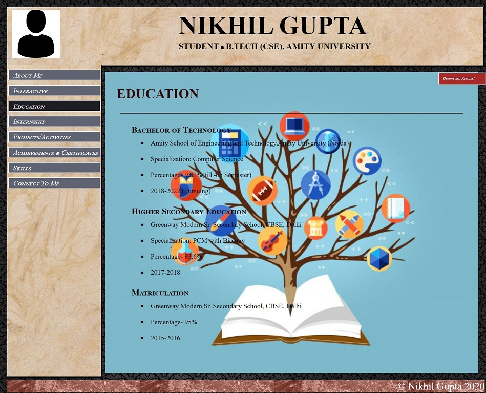
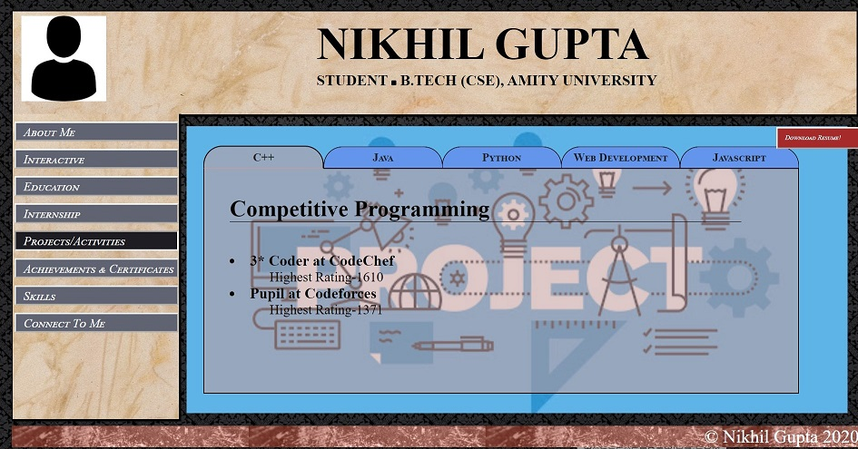
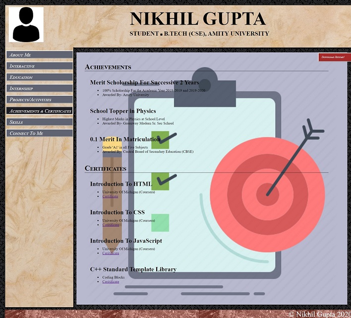
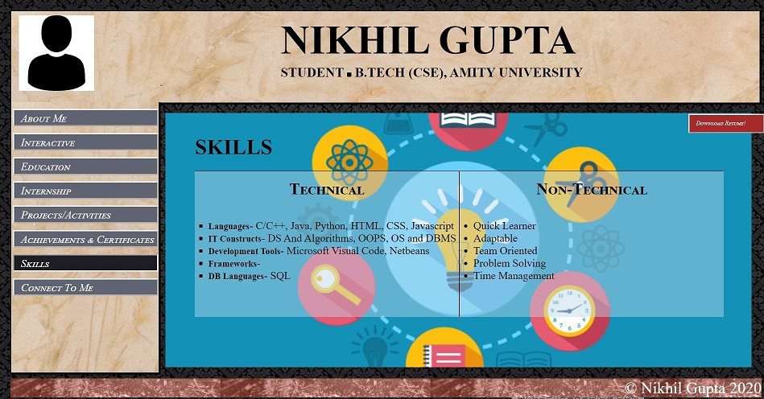
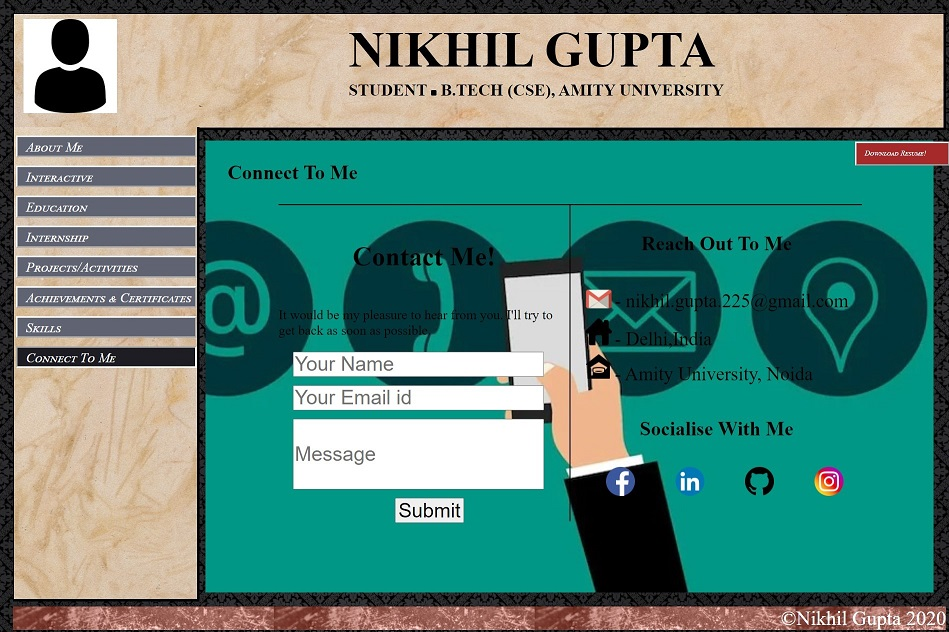
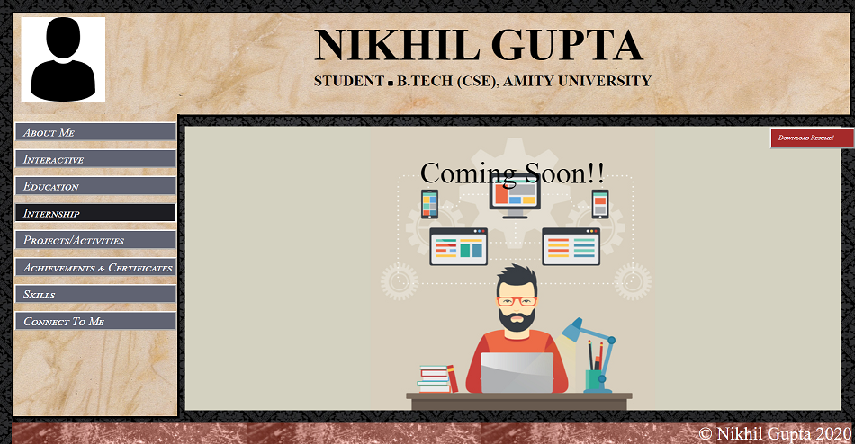
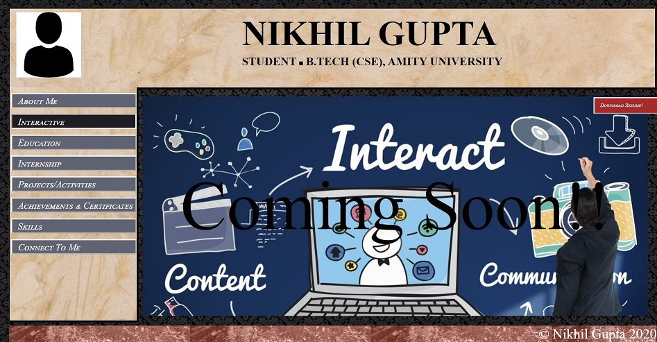

# Portfolio-Website
I have tried to make digital version of the my CV.
### 1.About Me 

 

### 2.Education

 

### 3.Project/Activities

 

### 4.Achievements

 

### 5. Skills

 

### 6.Connect To Me

 

### 7.Internship

 

### 7.Interactive

 
